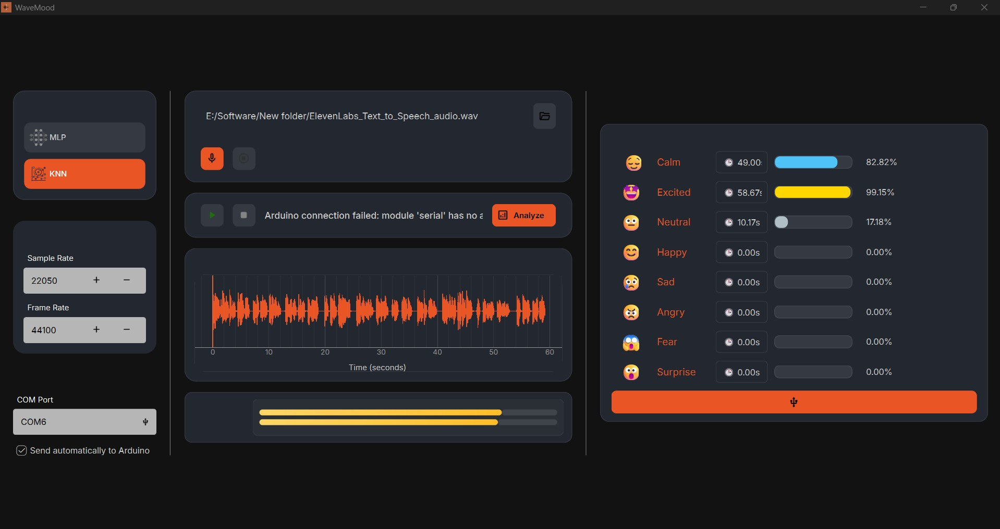

# WaveMood

WaveMood is an interactive desktop application for real-time emotion analysis from audio. It enables users to record or select audio files, visualize waveforms and volume, analyze emotional content using machine learning models, and communicate results to an Arduino device for physical feedback. Designed for both research and creative projects, WaveMood demonstrates practical integration of audio processing, ML, and hardware control.

---

## Features

- **Audio Recording & Playback**: Record live audio or select existing files (WAV, MP3, FLAC).
- **Waveform & Volume Visualization**: Real-time waveform and VU meter display.
- **Emotion Analysis**: Segment audio and predict emotions using MLP (TensorFlow/Keras) or KNN (scikit-learn) models.
- **Arduino Integration**: Send emotion results to Arduino via serial (COM port) for physical feedback (e.g., servo movement).
- **Modern UI**: PyQt6-based interface with styled controls and progress indicators.
- **Configurable Models & Settings**: Switch between ML models, adjust sample/frame rates, and set COM port.

---

## Quick Start

1. **Install Chocolatey (Windows only):**
   ```powershell
   Set-ExecutionPolicy Bypass -Scope Process -Force; [System.Net.ServicePointManager]::SecurityProtocol = [System.Net.ServicePointManager]::SecurityProtocol -bor 3072; iex ((New-Object System.Net.WebClient).DownloadString('https://community.chocolatey.org/install.ps1'))
   ```
2. **Install Make:**
   ```powershell
   choco install make
   ```
3. **Install uv (Python environment manager):**
   ```powershell
   choco install uv
   ```
4. **Clone the repository:**
   ```powershell
   git clone https://github.com/Sasindu99-ai/WaveMood.git
   cd WaveMood
   ```
5. **Sync dependencies:**
   ```powershell
   make sync
   ```
6. **Run the application:**
   ```powershell
   make run
   ```

---

## Usage

- **Select or Record Audio**: Use the UI to pick a file or record new audio.
- **Play, Pause, Stop**: Control playback and view waveform/volume.
- **Analyze**: Click "Analyze" to run emotion detection. Results are shown per emotion with duration and probability.
- **Arduino**: Configure COM port and send emotion results to Arduino for physical feedback.

---

## Developer Notes

- **Tech Stack**: Python, PyQt6, sounddevice, soundfile, numpy, scikit-learn, TensorFlow/Keras, serial.
- **ML Models**: Supports both KNN (scikit-learn) and MLP (TensorFlow/Keras). Model files (`.h5`, `.pkl`) should be placed in the project root.
- **Extensibility**: Modular design for adding new models, features, or hardware integrations.
- **Error Handling**: Robust UI feedback and logging for audio/model/serial errors.

---

## Resume Highlights

- **End-to-End Solution**: Designed and implemented a full-stack desktop application for audio-based emotion recognition.
- **Machine Learning Integration**: Developed and deployed ML models for real-time emotion analysis.
- **Hardware Communication**: Built serial communication logic to interface with Arduino for physical feedback.
- **UI/UX Design**: Created a modern, user-friendly interface with PyQt6 and custom widgets.
- **Cross-Disciplinary Skills**: Combined signal processing, ML, UI development, and hardware control in a single project.

---

## Screenshots



---

## License

MIT License

---

## Contact

For questions or collaboration, reach out via [GitHub Issues](https://github.com/Sasindu99-ai/WaveMood/issues) or email.
